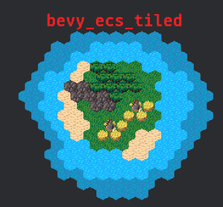

# bevy_ecs_tiled

[](https://crates.io/crates/bevy_ecs_tiled)
[](https://docs.rs/bevy_ecs_tiled/)
[](https://github.com/adrien-bon/bevy_ecs_tiled/blob/main/LICENSE)
[](https://crates.io/crates/bevy_ecs_tiled)
[](https://bevyengine.org/learn/quick-start/plugin-development/#main-branch-tracking)

[`bevy_ecs_tiled`](https://github.com/adrien-bon/bevy_ecs_tiled) is a [Bevy](https://bevyengine.org/) plugin for working with 2D tilemaps created with the [Tiled map editor](https://www.mapeditor.org/).

It relies upon the official [Tiled Rust bindings](https://github.com/mapeditor/rs-tiled) to parse and load Tiled map files and the [`bevy_ecs_tilemap` crate](https://github.com/StarArawn/bevy_ecs_tilemap) to perform rendering.

It aims to provide a simple and ergonomic workflow by using Tiled as an editor when working on Bevy 2D games.



## Features

- Support for several kind of maps: orthogonal, isometric or hexagonal maps, finite or infinite layers, with external or embedded tilesets, using atlases or several images.
- Support various Tiled features: animated tiles, images layers, tile objects or [Tiled world](https://doc.mapeditor.org/en/stable/manual/worlds/) when a single map is not enough.
- Each Tiled item, such as layer, tile or object, is represented by a Bevy entity and everything is organized under a Bevy hierarchy: layers are children of the Tiled map entity, tiles and objects are children of these layers. `Visibility` and `Transform` are automatically propagated down the hierarchy.
- Easily control how to spawn and despawn maps. Use Bevy events and observers to customize how your scene is spawned or notify you when the map is actually loaded and ready to use.
- Build your map in Tiled and let the plugin take care of the rest:
  - Automatically spawn [Rapier](https://rapier.rs/) or [Avian](https://github.com/Jondolf/avian) physics colliders on tiles or objects.
  - Use [Tiled custom properties](https://doc.mapeditor.org/en/stable/manual/custom-properties/) to automatically insert your own components on objects, tiles or layers.
- Hot-reloading: work on your map in Tiled and see it update in Bevy without having to re-compile / restart your game.

## Showcases

Update your Bevy components directly from Tiled editor :


Use several maps to build a huge world :


## Documentation

This crate is documented in three places:

- The [`bevy_ecs_tiled` book](https://adrien-bon.github.io/bevy_ecs_tiled/) with design explanations, how-to guides and migrations guides.
- The [API reference](https://docs.rs/bevy_ecs_tiled/latest/bevy_ecs_tiled/)
- The [examples folders](./examples/README.md), for concrete use cases.

There is notably a [FAQ](https://adrien-bon.github.io/bevy_ecs_tiled/FAQ.html) that will hopefully answer most of your questions.

Good reading!

## Getting started

Add required dependencies to your `Cargo.toml` file:

```toml
[dependencies]
bevy = "0.15"
bevy_ecs_tiled = "0.5"
bevy_ecs_tilemap = "0.15"
```

Then add the plugin to your app and spawn a map.
Basically, all you have to do is to spawn a [`TiledMapHandle`](https://docs.rs/bevy_ecs_tiled/latest/bevy_ecs_tiled/struct.TiledMapHandle.html) with the map asset you want to load (the `map.tmx` file).
Note that this map asset should be in your local assets folder, as well as required dependencies (such as images or tilesets).
By default, this is the `./assets/` folder.

```rust,no_run
use bevy::prelude::*;
use bevy_ecs_tiled::prelude::*;

fn main() {
    App::new()
        // Add Bevy default plugins
        .add_plugins(DefaultPlugins)
        // Add bevy_ecs_tiled plugin: note that bevy_ecs_tilemap::TilemapPlugin
        // will be automatically added as well if it's not already done
        .add_plugins(TiledMapPlugin::default())
        // Add our startup function to the schedule and run the app
        .add_systems(Startup, startup)
        .run();
}

fn startup(
  mut commands: Commands,
  asset_server: Res<AssetServer>
) {
    // Spawn a Bevy 2D camera
    commands.spawn(Camera2d);

    // Load a map asset and retrieve the corresponding handle
    let map_handle: Handle<TiledMap> = asset_server.load("map.tmx");

    // Spawn a new entity with this handle
    commands.spawn(TiledMapHandle(map_handle));
}
```

This simplistic example will load a map using default settings.
You can tweak how to load the map by adding various components on the map entity, notably:

- [`TiledMapAnchor`](https://docs.rs/bevy_ecs_tiled/latest/bevy_ecs_tiled/components/enum.TiledMapAnchor.html)
- [`TiledMapLayerZOffset`](https://docs.rs/bevy_ecs_tiled/latest/bevy_ecs_tiled/components/struct.TiledMapLayerZOffset.html)
- [`TilemapRenderSettings`](https://docs.rs/bevy_ecs_tilemap/latest/bevy_ecs_tilemap/map/struct.TilemapRenderSettings.html)
- [`Transform`](https://docs.rs/bevy/latest/bevy/transform/components/struct.Transform.html)
- [`Visibility`](https://docs.rs/bevy/latest/bevy/render/view/visibility/enum.Visibility.html)

For instance, here's how you load a map but change its anchor point to be at center instead of bottom-left :

```rust,no_run
use bevy::prelude::*;
use bevy_ecs_tiled::prelude::*;

fn spawn_map(
  mut commands: Commands,
  asset_server: Res<AssetServer>
) {
    // You can also spawn your map and associated settings as a single bundle
    commands.spawn((
      TiledMapHandle(asset_server.load("map.tmx")),
      TiledMapAnchor::Center,
    ));
}
```

You can browse the [examples](https://github.com/adrien-bon/bevy_ecs_tiled/tree/main/examples/README.md) for more advanced use cases.

## Bevy Compatibility

|bevy|bevy_ecs_tilemap|bevy_ecs_tiled|
|---|---|---|
|0.15|0.15|0.5|
|0.14|0.14|0.3 - 0.4|
|0.13|main@e4f3cc6|branch 0.2|
|0.12|0.12|0.1|

## Assets credits

- [colored tiles](./assets/tiles/): orthogonal tileset from [Steve Pryde](https://github.com/stevepryde), licensed under [CC0 1.0](https://creativecommons.org/publicdomain/zero/1.0/)
- [drjamgo_hex_16x16](https://opengameart.org/content/basic-hex-tile-set-16x16): an hexagonal "pointy-top" tileset from [Dr. Jango](https://opengameart.org/users/dr-jamgo), licensed under [CC0 1.0](https://creativecommons.org/publicdomain/zero/1.0/)
- [simple hex flat top](https://opengameart.org/content/simple-flat-top-hexagonal-tiles): an hexagonal "flat-top" tileset from [All things hex](https://opengameart.org/users/all-things-hex), licensed under [CC0 1.0](https://creativecommons.org/publicdomain/zero/1.0/)
- [kenney-sketch-desert](https://kenney.nl/assets/sketch-desert): an isometric tileset from [Kenney](https://kenney.nl/), licensed under [CC0 1.0](https://creativecommons.org/publicdomain/zero/1.0/)
- [Magic Market](https://gfragger.itch.io/magic-market): an orthogonal tileset from [GFragger](https://gfragger.itch.io/)

## Contributing

If you can contribute, please do!

If you would like to contribute but don't know where to start, [read this section in the book](https://adrien-bon.github.io/bevy_ecs_tiled/misc/contributing.html).

## LICENSE

This work is licensed under the MIT license.

`SPDX-License-Identifier: MIT`
