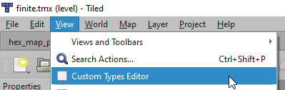
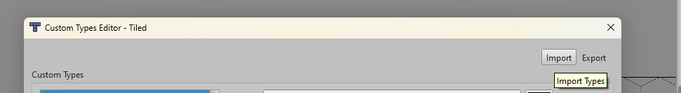
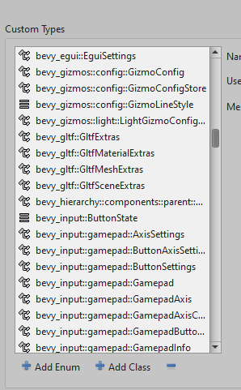
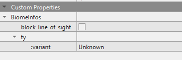

# Using Tiled Custom Properties

Tiled allows you to add "custom properties" to various items such as layers, tiles, objects, or maps.

These custom properties can be:

- **Standard types:** string, integer, float, color, etc.
- **Custom types:** your own structures with sub-properties (which can themselves be standard or custom types)

With `bevy_ecs_tiled`, you can load these custom properties into your game and access them as regular Bevy `Component` or `Resource`.  
This means you can define game logic directly in the Tiled editor and use it seamlessly in your Bevy game.

For example, you could:

- Associate a "movement cost" with a tile type
- Create an object representing your player or an enemy
- Add a generic "trigger zone" (e.g., damaging zone, victory zone)
- ...or anything else your game needs!

---

## Overview

The user properties mechanism relies on Bevy's reflection system.

To use custom properties from Tiled in your game, you need to:

1. **Enable the `user_properties` feature** in your local `Cargo.toml` file.
2. **Declare your custom types** in Rust and make them reflectable.
3. **Run your game once** to export these types as a `.json` file, readable by Tiled.
4. **Import this `.json` file** into the Tiled editor to make your types available as custom properties.

Once this is done, you can use your types directly in Tiled. When you load your map, the corresponding `Component` or `Resource` will be automatically inserted into your Bevy world.

For a quick demonstration, see the [dedicated example](https://github.com/adrien-bon/bevy_ecs_tiled/blob/main/examples/properties_basic.rs).

---

## Enabling the feature

Update your local `Cargo.toml` file to enable the `user_properties` feature:

```toml
[dependencies]
bevy = "0.16"
bevy_ecs_tiled = { version = "0.8", features = ["user_properties"] }
```

> **Note:**  
> You may need to adjust `bevy` and `bevy_ecs_tiled` versions.

---

## Declaring Types for Custom Properties

Each Tiled map, layer, tile, or object is represented by a Bevy `Entity`.  
If you want to add custom properties to them, these properties should be a `Component`.

To make your custom types usable in Tiled, they must be "reflectable":

- Derive the `Reflect` trait for your type.
- Register your type with Bevy.

**Example:**

```rust,no_run
use bevy::prelude::*;

// Declare a component and make it reflectable
#[derive(Component, Reflect, Default)]
#[reflect(Component, Default)]
struct BiomeInfos {
    block_line_of_sight: bool,
    ty: BiomeType,
}

// Any sub-type must also be reflectable, but does not need to be a Component
#[derive(Default, Reflect)]
#[reflect(Default)]
enum BiomeType {
    #[default]
    Unknown,
    Forest,
    Plain,
    Mountain,
    Desert,
}

// Register your top-level struct in the Bevy registry
fn main() {
    App::new()
        .register_type::<BiomeInfos>();
}
```

**Tip:**  
Deriving `Default` is useful: you don't have to fill all fields in Tiled; missing fields will use the type's default value.

---

## Importing Custom Properties into Tiled

Before you can add custom properties in Tiled, you need to export them from your app and import them into Tiled.

When running with the `user_properties` feature, your app will automatically produce a `.json` export of all types registered with Bevy.  
By default, this file is named `tiled_types_export.json` and is created in your workspace root.  
You can change the filename or disable export via [`TiledPluginConfig`](https://docs.rs/bevy_ecs_tiled/latest/bevy_ecs_tiled/tiled/struct.TiledPluginConfig.html).

To import this file in Tiled:

1. In Tiled, go to **View → Custom Types Editor**  
   
2. Click the **Import** button and select your `.json` file  
   
3. You will now see all custom types imported from your application  
   

---

## Adding Custom Properties in Tiled

Once imported, you can add custom properties to your map:

1. Select the element (map, layer, object, etc.) you want to add a property to.
2. In the "Custom Properties" panel, right-click and select **Add Property**  
   
3. Choose the type you want to add and give it a name.
4. For example, add the `BiomeInfos` type from the earlier example:  
   
5. Set the values as needed for this element.

When you load the map, the corresponding Bevy entity will have the appropriate `Component` with the values you set.

> **Note:**  
> Only add properties imported from Bevy. Properties created only in Tiled (ie. not exported from your app) will not be loaded in Bevy.
> You can also control which properties are exported from Bevy via [`TiledPluginConfig`](https://docs.rs/bevy_ecs_tiled/latest/bevy_ecs_tiled/tiled/struct.TiledPluginConfig.html)

---

## Special Considerations

- You can add custom properties to objects, layers, or the map itself.  
  To add properties to tiles, edit the tileset directly.  
  We currently do not support adding properties to the tileset itself.
- For more on adding custom properties, see the [official Tiled documentation](https://doc.mapeditor.org/en/stable/manual/custom-properties/).
- You can also add `Resource`s to your map.  
  Since resources are global and not attached to a specific entity, they are only supported as map-level properties.  
  If you add a resource to another Tiled element, it will be ignored.

---

With this workflow, you can design your game data visually in Tiled and have it automatically reflected in your Bevy game.
