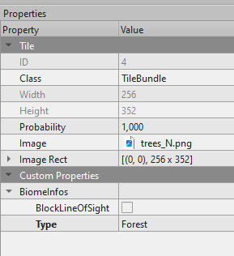
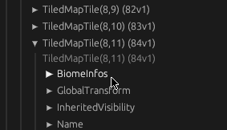

# Use Tiled custom properties

In Tiled we can add "custom properties" on various items like layers, tiles, objects or maps.

These custom properties can be either:

- a "standard type", like a string, an integer, a float, a color, etc...
- a "custom type", which is basically a structure with sub-properties that can either be a "standard type" or another "custom type"

In `bevy_ecs_tiled` we support mapping a "custom type" to a Bevy component, for objects and tiles entities.

Basically, it means that we can define some components directly in the Tiled map and use them with Bevy in your game logic.
It's very useful!

Using this mechanism, we could for instance:

- associate a "movement cost" to a given tile type
- create an object that represent our player or an ennemy
- add a generic "trigger zone" that could either be a "damaging zone" or a "victory zone"
- ... whatever you need for your game!

## Create a custom type

First step is to actually create a custom type.

To do so, in Tiled, navigate to View -> Custom Types Editor:


From this panel, you will be able to define your own custom type (think of it as a struct) and describe which fields it has.
For more information see the [official documentation](https://doc.mapeditor.org/en/stable/manual/custom-properties/#custom-types).


For instance, in the example above, we created a `TileBundle` custom type which has a single `BiomeInfos` field.
This `BiomeInfos` field is another custom type which has two fields: a boolean `BlockLineOfSight` and an enum `Type`.

We support all types except :

- the "enum as int" type: you should use instead the "enum as string"
- the "object" type: you cannot (yet) reference another object

## Assign custom properties to an object or a to a tile

Please note that we do not support adding directly custom properties and you must use a custom type.

First, you need to update the "class" property and set the custom type you want.

- For objects you can just select the object you want from the map. Only the selected object will have custom properties.
- For tiles, you need to edit the tileset then select the tile you want. All tiles of this kind will get custom properties.



Once the class is set, it will automatically add the custom type fields (with their default value) corresponding to this custom type to the "custom properties" tab.
You can then edit the properties you want, as it fits your game.

For instance, in the picture above, we declared our tile to be a `TileBundle`:

- we left `BiomeInfos.BlockLineOfSight` to its default value (which happens to be `false`)
- we set `BiomeInfos.Type` to be a `Forest`

## Retrieve custom properties and map them to a Bevy component

To actually retrieve these custom properties in your game, you need to do three things:

- Enable the `user_properties` feature
- Define your custom type
- Register your custom type

First, to enable the `user_properties` feature, you need to update your `Cargo.toml` file:

```toml
[dependencies]
bevy_ecs_tiled = { version = "XXX", features = [ "user_properties" ] }
```

Then, you can define your custom type:

```rust,no_run
// If declaring a custom type for an objet,
// you should use instead the TiledObject derive
#[derive(TiledCustomTile, Bundle, Default, Debug, Reflect)]
struct TileBundle {
    #[tiled_rename = "BiomeInfos"]
    infos: BiomeInfos,
}
```

As well as other types it refers to:

```rust,no_run
#[derive(TiledClass, Component, Default, Debug, Reflect)]
struct BiomeInfos {
    #[tiled_rename = "Type"]
    ty: BiomeType,
    #[tiled_rename = "BlockLineOfSight"]
    block_line_of_sight: bool,
}

#[derive(TiledEnum, Default, Reflect, Debug)]
enum BiomeType {
    #[default]
    Unknown,
    Plain,
    Desert,
    Forest,
    Mountain,
}
```

Note that these custom types definitions should match what you have declared in Tiled custom types editor.

Finally, you can register your custom type before starting the app:

```rust,no_run
fn main() {
    App::new()
        // If registering an object, use register_tiled_object() instead
        .register_tiled_custom_tile::<TileBundle>("TileBundle")
        .run();
}
```

When loading a map which has tiles with the `TileBundle` custom type, corresponding components will be automatically inserted on the tile entity and have their value based upon the properties you set in Tiled.



Note that you only see the `BiomeInfos` type and not `TileBundle`.
That's because `TileBundle` is a `Bundle`, which is actually a collection of `Component`s.

## Using a `Component` vs. a `Bundle`

This may change in the future, but `bevy_ecs_tiled` currently allows you to either use a Bevy `Component` or a Bevy `Bundle` to represent your tiles and objects.

It means that your custom type can either be:

- a set of "standard type" fields (ie. no nested custom type), in that case it should be a `Component`.
- a set of "custom type" fiels, in that case it should be a `Bundle` and additional `CustomClass` structs should be declared.

Note that it's an "all or nothing" mode.
If you have a nested custom type, your struct must be a `Bundle` and it cannot contains an additional "standard type".

## Further readings

You can have a look at the [`properties` module API reference](https://docs.rs/bevy_ecs_tiled/latest/bevy_ecs_tiled/properties/index.html) or the [dedicated example](https://github.com/adrien-bon/bevy_ecs_tiled/blob/main/examples/user_properties.rs).

More specifically, [which attributes can be used for derive macros](https://docs.rs/bevy_ecs_tiled/latest/bevy_ecs_tiled/properties/prelude/index.html) or [the content of observer events](https://docs.rs/bevy_ecs_tiled/latest/bevy_ecs_tiled/properties/events/index.html).
